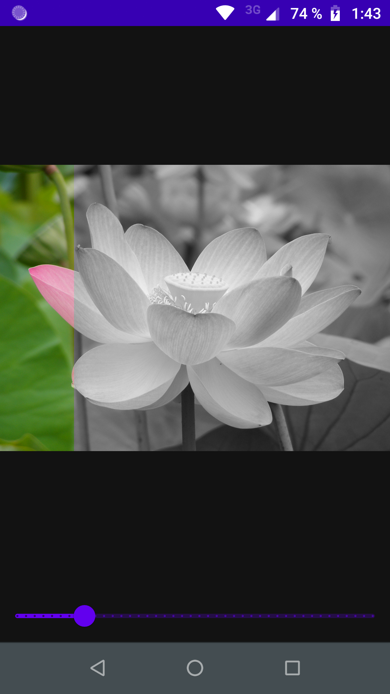
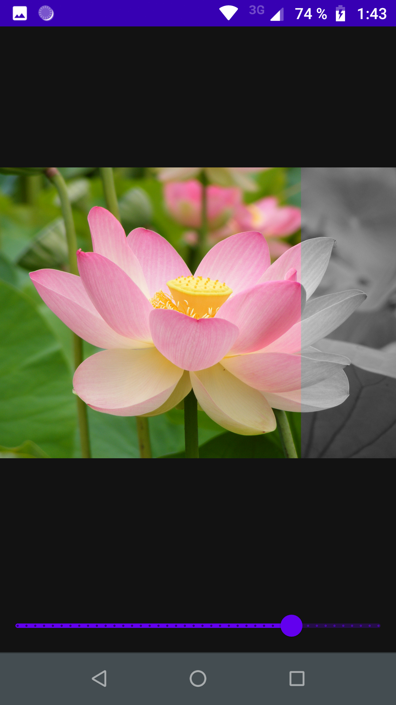
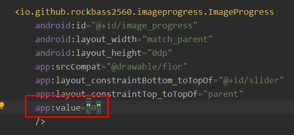
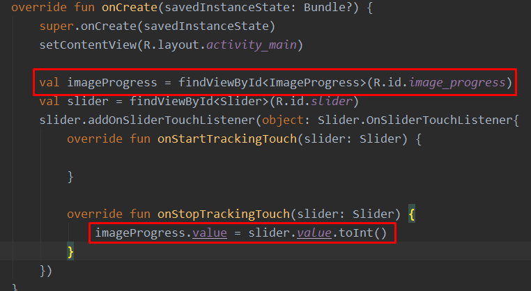

# ImageProgress
ImageProgress is an android library to show the loading progress in an ImageView painting a part of the image in original color an the rest in black and white.

ImageView with 15% of progress  

Same image with 75% of progress  

## Instalation
You need to add this line in your build.gradle

implementation 'io.github.rockbass2560:imageprogress:1.0.0'

## Example of use

You can add the view in your layout.xml, the attribute value needs to be a value between 0 and 100 (percent value of the image view)

To change the value you can modify value property and the image will paint color part automatically

